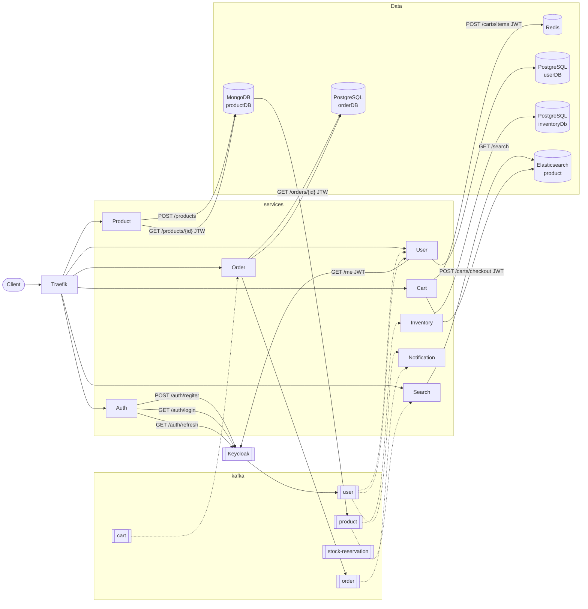

# microservice-java-spring


[](https://github.com/Vagnerlg/microservice-java-spring/actions/workflows/auth-quality.yml)
[](https://github.com/Vagnerlg/microservice-java-spring/actions/workflows/user-quality.yml)
[](https://github.com/Vagnerlg/microservice-java-spring/actions/workflows/product-quality.yml)

[](https://github.com/Vagnerlg/microservice-java-spring/actions/workflows/search-quality.yml)
[](https://github.com/Vagnerlg/microservice-java-spring/actions/workflows/cart-quality.yml)
[](https://github.com/Vagnerlg/microservice-java-spring/actions/workflows/order-quality.yml)

[](https://github.com/Vagnerlg/microservice-java-spring/actions/workflows/inventory-quality.yml)
[](https://github.com/Vagnerlg/microservice-java-spring/actions/workflows/notification-quality.yml)

Plataforma de e-commerce construída com **Java 21 + Spring Boot 4**, organizada em microserviços independentes. Cada serviço possui seu próprio banco de dados e se comunica via **Apache Kafka**.

Todos os 8 microserviços estão implementados e integrados — a plataforma está operacional como portfolio.

---

## Stack

| | Tecnologias |
|---|---|
| **Linguagem & Framework** | Java 21 · Spring Boot 4 |
| **Bancos de dados** | MongoDB · PostgreSQL + Flyway · Elasticsearch |
| **Cache / Identidade** | Redis · Keycloak 26 |
| **Mensageria** | Apache Kafka |
| **Observabilidade** | OpenTelemetry · Grafana (Tempo · Loki · Prometheus) |
| **Infraestrutura** | Traefik · Docker |
| **Testes** | JUnit 5 · Mockito · Testcontainers |
| **CI/CD** | GitHub Actions · JaCoCo · SpotBugs · PMD |

---

## Serviços

| Serviço                 | Tecnologias                     | Descrição                                                                         | Doc                                 |
|-------------------------|---------------------------------|-----------------------------------------------------------------------------------|-------------------------------------|
| `auth-service`          | Keycloak, Redis, Kafka, Otel    | Faz uma ponte com o keycloak com registro, login, refresh e logout para o projeto | [README.md](services/auth/)         |
| `user-service`          | PostgreSQL, Flyway, Kafka, Otel | Adiciona dados extra e keycloadId que pode ser consumido por outros serviços      | [README.md](services/user/)         |
| `product-service`       | MongoDB, kafka, Otel            | Catálogo de produtos                                                              | [README.md](services/product/)      |
| `search-service`        | Elasticsearch, kafka, Otel      | Busca de produtos com Elasticsearch                                               | [README.md](services/search/)       |
| `cart-service`          | Redis, Kafka, Otel              | Carrinho de compras                                                               | [README.md](services/cart/)         |
| `order-service`         | PostgreSQL, Flyway, Kafka, Otel | Pedidos, Saga coreografada                                                        | [README.md](services/order/)        |
| `inventory-service`     | PostgreSQL, Flyway, Kafka, Otel | Controle de estoque, Saga coreografada                                            | [README.md](services/inventory/)    |
| `notification-service`  | Kafka, Otel                     | Consumidor Kafka puro e por hora apenas log as notificações                       | [README.md](services/notification/) |

# Arquitetura e comunicação entre os serviços



---

## auth-service

Serviço de autenticação da plataforma. Delega identidade e sessões ao Keycloak, sem armazenar usuários localmente.

- **Keycloak 26** como IdP: registro via Admin API, login/refresh/logout via ROPC
- **Redis** para blacklist de JTI — invalida access tokens sem aguardar expiração natural
- **Kafka** publica `user.CREATED` no tópico `user` a cada novo cadastro, consumido pelo `user-service`
- **Testcontainers** nos testes de integração
- **Quality gates** cobertura ≥ 80% (JaCoCo), SpotBugs e PMD com zero violações

Consulte o [README do auth-service](services/auth/README.md) para detalhes da API, integração Keycloak e variáveis de ambiente.

---

## user-service

Serviço de perfis de usuário da plataforma. Não gerencia autenticação — delega isso ao `auth-service`.

- **Kafka consumer** — consome `user.CREATED` do tópico `user` publicado pelo `auth-service` a cada novo cadastro
- **PostgreSQL** como store de perfis — schema gerenciado por Flyway (`V1__create_users.sql`)
- **`GET /users/me`** — único endpoint REST; requer JWT do Keycloak, lê `keycloakId` do claim `sub`
- **Idempotente** — eventos duplicados com o mesmo `keycloakId` são descartados silenciosamente
- **Testcontainers** nos testes de integração
- **Quality gates** cobertura ≥ 80% (JaCoCo), SpotBugs e PMD com zero violações

Consulte o [README do user-service](services/user/README.md) para detalhes da API, variáveis de ambiente e como rodar localmente.

---

## product-service

Implementa criação e consulta de produtos, a busca de produtos fica com o `search-service` com Elasticsearch:

- **MongoDB** como banco de documentos
- **API REST** com envelope de resposta padronizado `{ data }` / `{ errors }`
- **Testcontainers** nos testes de integração
- **Quality gates** cobertura ≥ 80% (JaCoCo), SpotBugs e PMD com zero violações

Consulte o [README do product-service](services/product/README.md) para detalhes da API, como rodar localmente e guia de testes.

---

## search-service

Serviço de busca da plataforma. Implementa o modelo de leitura CQRS: consome eventos do Kafka e mantém o índice Elasticsearch atualizado.

- **Kafka consumer** — consome `product.CREATED`, `UPDATED` e `DELETED` do tópico `product`
- **Elasticsearch** como store de leitura — busca full-text paginada com filtro por categoria
- **Sem banco transacional próprio** — read model puro, sem HTTP de escrita
- **Testcontainers** nos testes de integração
- **Quality gates** cobertura ≥ 80% (JaCoCo), SpotBugs e PMD com zero violações

Consulte o [README do search-service](services/search/README.md) para detalhes da API, contrato de eventos e como rodar localmente.

---


## cart-service

Serviço de carrinho de compras da plataforma. Armazena o carrinho de cada usuário no Redis e coordena o início do fluxo de pedidos via Kafka.

- **Redis** como storage — chave `cart:{userId}` com TTL de 7 dias; upsert de item soma quantidade ao existente
- **JWT obrigatório** — resource server OAuth2; `userId` extraído do claim `sub` do token Keycloak
- **6 endpoints REST** — get, add item, update item, remove item, clear e checkout
- **`POST /carts/checkout`** publica `cart.CHECKOUT` no tópico `cart` e apaga o carrinho atomicamente
- **Testcontainers** nos testes de integração
- **Quality gates** cobertura ≥ 80% (JaCoCo), SpotBugs e PMD com zero violações

Consulte o [README do cart-service](services/cart/README.md) para detalhes da API, contrato do evento e como rodar localmente.

---

## order-service

Serviço de pedidos da plataforma. Orquestra o ciclo de vida do pedido desde o checkout até a confirmação de estoque.

- **Kafka consumer** — consome `cart.CHECKOUT` para criar pedidos e `stock-reservation.RESERVED/UNAVAILABLE` para avançar o status via Saga
- **PostgreSQL** como store transacional — schema gerenciado por Flyway (`V1__create_orders.sql`, `V2__create_order_items.sql`)
- **Saga coreografada** — `PENDING → CONFIRMED` ao receber `stock.RESERVED`; `PENDING → CANCELLED` ao receber `stock.UNAVAILABLE` ou por ação do usuário
- **3 endpoints REST** — listagem paginada, consulta por ID e cancelamento pelo usuário (todos exigem JWT)
- **Testcontainers** nos testes de integração
- **Quality gates** cobertura ≥ 80% (JaCoCo), SpotBugs e PMD com zero violações

Consulte o [README do order-service](services/order/README.md) para detalhes da API, fluxo da Saga e como rodar localmente.

---

## inventory-service

Serviço de controle de estoque da plataforma. Participa da Saga coreografada com o `order-service` para reservar ou recusar estoque.

- **Kafka consumer** — consome `product.CREATED` para inicializar estoque (10 unidades) e `order.CREATED` / `order.CANCELLED` para reservar e liberar estoque
- **PostgreSQL** como store transacional — schema gerenciado por Flyway (`V1__create_stock.sql`)
- **Sem HTTP API** — toda interação ocorre via Kafka; Actuator disponível na porta `8161`
- **Saga coreografada** — publica `stock-reservation.RESERVED` ou `stock-reservation.UNAVAILABLE` conforme disponibilidade de cada item do pedido
- **Testcontainers** nos testes de integração
- **Quality gates** cobertura ≥ 80% (JaCoCo), SpotBugs e PMD com zero violações

Consulte o [README do inventory-service](services/inventory/README.md) para detalhes dos eventos, fluxo da Saga e como rodar localmente.

---

## notification-service

Serviço de notificações da plataforma. **Consumidor Kafka puro** — sem banco de dados, sem API REST.

- **Kafka consumer** — consome 4 tipos de eventos: `order.CREATED`, `order.CANCELLED`, `user.CREATED` e `stock-level.LOW`
- **Log-only** — cada evento gera um log estruturado (`INFO` ou `WARN`) correlacionado ao traceId do OpenTelemetry
- **Sem banco de dados** — é um sink de eventos; o processamento é stateless
- **Resiliente a falhas de desserialização** — erros são logados e o offset avança sem propagar exceções
- **Testcontainers** nos testes de integração
- **Quality gates** cobertura ≥ 80% (JaCoCo), SpotBugs e PMD com zero violações

Consulte o [README do notification-service](services/notification/README.md) para detalhes dos eventos consumidos e variáveis de ambiente.

---

## Arquitetura HTTP

Todos os serviços seguem os mesmos padrões de contrato REST.

### Envelope de resposta

**Sucesso** — corpo sempre envolto em `data`:

```json
{ "data": { ...campos do recurso... } }
```

**Erro** — lista de erros com `field` (campo inválido, ou `null` para erros de negócio):

```json
{
  "errors": [
    { "field": "username", "message": "não deve estar em branco" },
    { "field": null,       "message": "User already exists: joao" }
  ]
}
```

### Status HTTP

| Status | Situação |
|---|---|
| `200 OK` | Leitura ou operação bem-sucedida com corpo |
| `201 Created` | Recurso criado com sucesso |
| `204 No Content` | Operação bem-sucedida sem corpo (ex: logout) |
| `401 Unauthorized` | Credenciais inválidas ou token expirado |
| `404 Not Found` | Recurso não encontrado |
| `409 Conflict` | Conflito de unicidade (ex: username já existe) |
| `422 Unprocessable Entity` | Falha de Bean Validation — campos inválidos |
| `500 Internal Server Error` | Erro interno (ex: falha ao publicar no Kafka) |

---

## Arquitetura Kafka

Todos os eventos seguem o padrão **topic per aggregate** com envelope fixo:

```json
{ "event": "CREATED", "data": { ...campos do agregado... } }
```

| Tópico | Eventos |
|---|---|
| `user` | `CREATED` |
| `product` | `CREATED` · `UPDATED` · `DELETED` |
| `order` | `CREATED` · `CANCELLED` |
| `cart` | `CHECKOUT` |
| `stock-reservation` | `RESERVED` · `UNAVAILABLE` · `RELEASED` |
| `stock-level` | `LOW` |

---

## Testando a plataforma

Quer explorar os fluxos da plataforma manualmente com `curl`? Consulte o **[Tutorial de teste manual](docs/tutorial.md)** — cobre os três cenários principais (happy path, estoque esgotado, busca CQRS) com comandos prontos para copiar, do setup do zero até os fluxos de Saga.

Para um demo interativo com passo a passo automático, execute `./demo.sh`.

---

## Ambiente Local

### Subir / parar a stack

```bash
# Subir tudo
docker compose up -d

# Parar e remover containers
docker compose down
```

> **Primeira subida em máquina nova:** o `docker compose up -d` builda a `observability-lib` antes de qualquer serviço iniciar, e cada serviço ainda baixa suas próprias dependências Maven pela primeira vez — isso pode levar alguns minutos. Se você bater nas rotas do Traefik logo após o comando retornar e receber `404`, é porque os serviços ainda não terminaram de subir (o router daquele serviço só existe no Traefik depois que o container está de pé). Acompanhe o boot com:
> ```bash
> docker compose logs -f product auth cart user order inventory search notification | grep "Started.*Application"
> ```
> Quando as 8 linhas `Started XxxApplication in X seconds` aparecerem, a stack está pronta para receber requisições.

---

### Serviços de Aplicação

Todo tráfego HTTP passa pelo **Traefik** na porta `8080`. Portas HTTP diretas foram removidas.

| Serviço | URL externa |
|---|---|
| auth-service | `http://localhost:8080/api/auth` |
| user-service | `http://localhost:8080/api/users` |
| product-service | `http://localhost:8080/api/products` |
| search-service | `http://localhost:8080/api/search` |
| cart-service | `http://localhost:8080/api/carts` |
| order-service | `http://localhost:8080/api/orders` |

`inventory-service` e `notification-service` não expõem HTTP — Kafka consumer puro.

---

### Plataforma e Observabilidade

| Ferramenta | URL |
|---|---|
| **Traefik Dashboard** | `http://localhost:8090/dashboard/` |
| **Grafana** | `http://localhost:8080/grafana` |
| **Prometheus** | `http://localhost:8080/prometheus` |
| **Keycloak Admin** | `http://localhost:8080/keycloak` |
| **Kafka UI** | `http://localhost:8080/kafka` |
| **Mongo Express** | `http://localhost:8080/mongo` |

---

### Infraestrutura de Dados (acesso direto)

| Serviço | Host:Porta |
|---|---|
| PostgreSQL | `localhost:5432` |
| MongoDB | `localhost:27017` |
| Redis | `localhost:6379` |
| Kafka | `localhost:9092` |
| Elasticsearch | `localhost:9200` |

---

### Debug JDWP (IDE)

| Serviço | Porta |
|---|---|
| product-service | 5005 |
| auth-service | 5006 |
| search-service | 5007 |
| user-service | 5008 |
| cart-service | 5009 |
| order-service | 5010 |
| inventory-service | 5011 |
| notification-service | 5012 |

---

## Melhorias Futuras

Itens fora do escopo do portfolio, documentados para demonstrar consciência arquitetural.

| Item | Serviço(s) | Descrição |
|---|---|---|
| Outbox Pattern + Debezium | `order`, `inventory` | Eventos são publicados direto no Kafka — risco de inconsistência em caso de crash entre a transação e o envio |
| Dead Letter Topic / retry | Todos os consumers | Eventos com falha de desserialização são descartados sem reprocessamento |
| `stock-level.LOW` | `inventory` | Evento de alerta de estoque baixo para o `notification-service` não está implementado |
| API REST de estoque | `inventory` | Ajuste manual de `totalQuantity` via HTTP não está disponível — inicialização é feita apenas via evento `product.CREATED` |
| Libs compartilhadas | Todos | `security-lib`, `kafka-events-lib` e `common-lib` não existem — cada serviço reimplementa padrões próprios |
