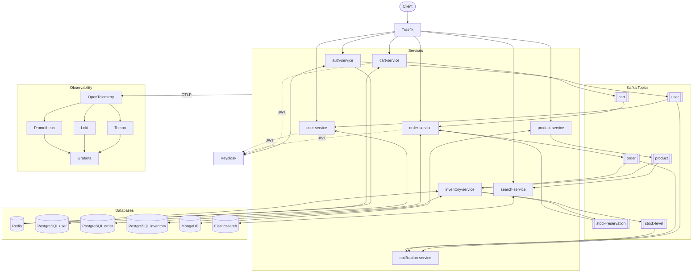

# Architecture — Full Detail

## Stack

| Layer | Technology |
|---|---|
| Ingress | Traefik (IngressRoute CRDs) |
| Event Streaming | Apache Kafka |
| Cache | Redis |
| Relational DB | PostgreSQL + Flyway |
| Document DB | MongoDB |
| Search | Elasticsearch |
| Identity | Keycloak (OAuth2 / OIDC) |
| Observability | OpenTelemetry + Grafana (Tempo + Loki + Prometheus) |

---

## Service Map

| Service | Port | Actuator | Database | Role |
|---|---|---|---|---|
| auth-service | 8120 | 8121 | Redis (blacklist) | OAuth2/JWT via Keycloak |
| product-service | 8101 | 8102 | MongoDB | Product catalog |
| search-service | 8110 | 8111 | Elasticsearch | CQRS read model |
| user-service | 8130 | 8131 | PostgreSQL | User profiles |
| cart-service | 8140 | 8141 | Redis | Shopping cart (TTL 7d) |
| order-service | 8150 | 8151 | PostgreSQL | Orders + Saga |
| inventory-service | 8160 | 8161 | PostgreSQL + Redis | Stock control |
| notification-service | 8170 | 8171 | — | Kafka consumer only |

---

## HTTP API Endpoints

```
auth-service
  POST /auth/register
  POST /auth/login
  POST /auth/refresh
  POST /auth/logout

user-service
  GET  /users/me

cart-service
  GET    /carts
  POST   /carts/items
  PUT    /carts/items/{productId}
  DELETE /carts/items/{productId}
  DELETE /carts
  POST   /carts/checkout

product-service
  POST   /products
  GET    /products/{id}
  PUT    /products/{id}
  DELETE /products/{id}

order-service
  GET    /orders
  GET    /orders/{id}
  DELETE /orders/{id}

search-service
  GET /search?q={query}&category={category}

inventory-service   → no public HTTP API
notification-service → no HTTP API (Kafka consumers only)
```

---

## Kafka Topics

| Topic | Events | Producer | Consumers |
|---|---|---|---|
| `user` | CREATED | auth-service | user-service, notification-service |
| `cart` | CHECKOUT | cart-service | order-service |
| `product` | CREATED, UPDATED, DELETED | product-service | inventory-service (CREATED), search-service (all) |
| `order` | CREATED, CANCELLED | order-service | inventory-service (both), notification-service (both) |
| `stock-reservation` | RESERVED, UNAVAILABLE | inventory-service | order-service |
| `stock-level` | LOW | inventory-service | notification-service |

> **Note:** Outbox Pattern + Debezium (PostgreSQL WAL CDC) is planned but not yet implemented.
> order-service currently publishes directly via `kafkaTemplate.send()`.

---

## Saga Flow — Checkout

```
POST /carts/checkout
  └─ cart-service publishes cart.CHECKOUT
       └─ order-service consumes → creates Order → publishes order.CREATED
            └─ inventory-service consumes
                 ├─ stock OK  → publishes stock-reservation.RESERVED
                 │    └─ order-service confirms Order
                 └─ stock NOK → publishes stock-reservation.UNAVAILABLE
                      └─ order-service cancels Order → publishes order.CANCELLED
```

---

## Diagram


