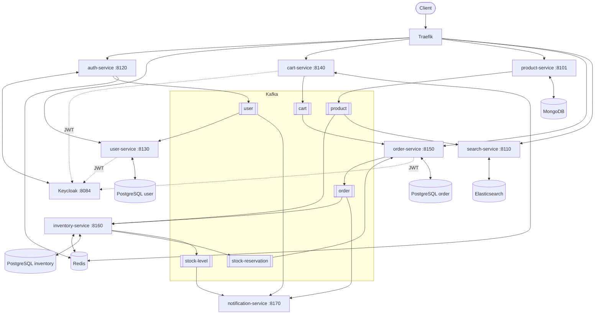

# Architecture Overview

```mermaid
flowchart TB
    Client([Client]) --> Traefik[Traefik]

    Traefik --> Auth[auth-service :8120]
    Traefik --> User[user-service :8130]
    Traefik --> Cart[cart-service :8140]
    Traefik --> Product[product-service :8101]
    Traefik --> Order[order-service :8150]
    Traefik --> Search[search-service :8110]

    Auth <--> Keycloak[Keycloak :8084]
    Cart -.->|JWT| Keycloak
    Order -.->|JWT| Keycloak
    User -.->|JWT| Keycloak

    subgraph Kafka
        Tu[[user]]
        Tc[[cart]]
        Tp[[product]]
        To[[order]]
        Tr[[stock-reservation]]
        Ts[[stock-level]]
    end

    Auth --> Tu
    Cart --> Tc
    Product --> Tp
    Order --> To
    Inventory[inventory-service :8160] --> Tr
    Inventory --> Ts

    Tu --> User
    Tu --> Notification[notification-service :8170]
    Tc --> Order
    Tp --> Inventory
    Tp --> Search
    To --> Inventory
    To --> Notification
    Tr --> Order
    Ts --> Notification

    Auth --> Redis[(Redis)]
    Cart <--> Redis
    Inventory <--> Redis
    User <--> PG_U[(PostgreSQL user)]
    Order <--> PG_O[(PostgreSQL order)]
    Inventory <--> PG_I[(PostgreSQL inventory)]
    Product <--> Mongo[(MongoDB)]
    Search <--> ES[(Elasticsearch)]
```
